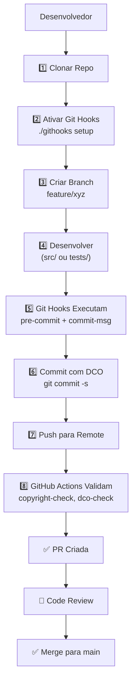

# 📁 Arquitetura do Projeto - Python RAG Project

## 🎯 Visão Geral da Estrutura

Este documento descreve a estrutura completa de pastas e arquivos do projeto Python RAG.

---

## 📊 Estrutura Principal

```
python_project/
│
├── 📁 .github/                          ⚙️ Configurações GitHub
│   ├── 📄 CODEOWNERS                    # Definição de revisores
│   ├── 📄 DCO                           # Developer Certificate of Origin
│   └── 📁 workflows/
│       ├── 📄 copyright-check.yml       # Workflow: Verifica headers de copyright
│       ├── 📄 dco-check.yml             # Workflow: Valida DCO sign-off
│       └── 📄 detect-copies.yml         # Workflow: Detecta cópias não autorizadas
│
├── 📁 .githooks/                        🔨 Git Hooks Locais
│   ├── 📄 pre-commit                    # Hook: Adiciona headers de copyright
│   └── 📄 commit-msg                    # Hook: Valida mensagens de commit
│
├── 📁 .cursor/                          💾 Cursor AI Memory System
│   ├── 📁 memory-system/                # Sistema de memória RAG
│   ├── 📁 rules/                        # Regras de negócio do projeto
│   └── 📁 .rag/                         # Índices FAISS para RAG
│
├── 📁 .vscode/                          🔧 VSCode Configuration
│   └── 📄 settings.json                 # Configurações do VSCode
│
├── 📁 docs/                             📚 Documentação
│   ├── 📄 architecture.md               # Arquitetura do sistema
│   ├── 📄 COPYRIGHT_PROTECTION.md       # Sistema de proteção (4 camadas)
│   ├── 📄 COPYRIGHT_QUICK_REFERENCE.md  # Referência rápida copyright
│   ├── 📄 GPG_SIGNING.md                # Guia de assinatura GPG
│   ├── 📄 SETUP_CHECKLIST.md            # Checklist de configuração
│   ├── 📁 api/                          # Documentação de API
│   │   └── 📄 endpoints.md              # Endpoints disponíveis
│   └── 📁 guides/                       # Guias de uso
│       └── 📄 quick_start.md            # Início rápido
│
├── 📁 scripts/                          🔧 Scripts Utilitários
│   ├── 📄 add_copyright_headers.py      # Script: Adiciona headers de copyright
│   └── 📄 generate_tree.py              # Script: Gera visualização da arquitetura
│
├── 📁 src/                              💻 Código-fonte Principal
│   │
│   ├── 📁 core/                         ⚙️ Núcleo da Aplicação
│   │   ├── 📁 domain/                   # Modelos de domínio
│   │   ├── 📁 repositories/             # Padrão Repository
│   │   └── 📁 services/                 # Lógica de negócio
│   │
│   ├── 📁 features/                     🎯 Features/Funcionalidades
│   │   ├── 📁 conversation/             # Feature: Conversas
│   │   ├── 📁 rag/                      # Feature: RAG (Retrieval-Augmented Generation)
│   │   └── 📁 reranking/                # Feature: Reranking de resultados
│   │
│   ├── 📁 infrastructure/               🏗️ Infraestrutura
│   │   ├── 📁 config/                   # Configurações da aplicação
│   │   ├── 📁 database/                 # Camada de dados
│   │   │   └── 📁 banco_faiss/          # FAISS Vector Database
│   │   ├── 📁 external/                 # Integrações externas
│   │   │   └── 📄 langsmith_integration.py  # LangSmith Integration
│   │   └── 📁 logging/                  # Sistema de logging
│   │
│   └── 📁 shared/                       🔄 Código Compartilhado
│       ├── 📁 types/                    # Type definitions (Pydantic models)
│       └── 📁 utils/                    # Funções utilitárias
│
├── 📁 tests/                            🧪 Testes
│   ├── 📁 e2e/                          # Testes End-to-End
│   ├── 📁 integration/                  # Testes de Integração
│   ├── 📁 unit/                         # Testes Unitários
│   └── 📄 conftest.py                   # Configuração de testes (pytest)
│
├── 🔐 Documentos de Governança
│   ├── 📄 README.md                     # Página principal (com Copyright & Citação)
│   ├── 📄 LICENSE                       # Licença MIT
│   ├── 📄 NOTICE                        # Atribuição obrigatória (Apache-style)
│   ├── 📄 CITATION.cff                  # Citação acadêmica (Citation File Format 1.2.0)
│   ├── 📄 CODE_OF_CONDUCT.md            # Código de Conduta
│   ├── 📄 CONTRIBUTING.md               # Guia de Contribuição (com DCO)
│   └── 📄 SECURITY.md                   # Política de Segurança
│
├── ⚙️ Configurações de Projeto
│   ├── 📄 pyproject.toml                # Configuração Poetry/Python
│   ├── 📄 requirements.txt               # Dependências principais
│   ├── 📄 requirements-dev.txt           # Dependências desenvolvimento
│   ├── 📄 pytest.ini                    # Configuração pytest
│   ├── 📄 .env.example                  # Exemplo de variáveis de ambiente
│   ├── 📄 .gitignore                    # Arquivos ignorados por Git
│   ├── 📄 .editorconfig                 # Configuração de editor
│   └── 📄 .gitattributes                # Atributos de Git
│
└── 📄 app.py                            🚀 Ponto de Entrada Principal
```

---

## 📋 Descrição por Camada

### 🛡️ **Camada 1: Proteção Legal**

- `LICENSE` - Termos de uso (MIT License)
- `NOTICE` - Requisitos de atribuição (Apache-style)
- `CITATION.cff` - Formato padronizado para citação acadêmica
- `CODE_OF_CONDUCT.md` - Normas de comportamento
- `SECURITY.md` - Política de segurança
- `CONTRIBUTING.md` - Guia de contribuição com DCO

### 🤖 **Camada 2: Automação (GitHub Actions)**

- `.github/workflows/copyright-check.yml` - Verifica headers de copyright
- `.github/workflows/dco-check.yml` - Valida DCO sign-off em commits
- `.github/workflows/detect-copies.yml` - Detecta código duplicado não autorizado

### 🔧 **Camada 3: Proteção Local (Git Hooks)**

- `.githooks/pre-commit` - Adiciona headers de copyright automaticamente
- `.githooks/commit-msg` - Valida mensagens de commit e DCO

### 📚 **Camada 4: Documentação**

- `docs/COPYRIGHT_PROTECTION.md` - Documentação completa (4 camadas)
- `docs/GPG_SIGNING.md` - Guia de assinatura digital
- `docs/SETUP_CHECKLIST.md` - Checklist de configuração
- `docs/COPYRIGHT_QUICK_REFERENCE.md` - Referência rápida

---

## 🏗️ Estrutura de Código (src/)

### 💻 **src/core/** - Núcleo da Aplicação

Contém a lógica central do sistema RAG:

- **domain/** - Entidades e modelos de domínio
- **repositories/** - Implementação do padrão Repository para acesso a dados
- **services/** - Lógica de negócio e casos de uso

### 🎯 **src/features/** - Funcionalidades Principais

Organizado por feature (vertical slice architecture):

- **conversation/** - Gerenciamento de conversas
- **rag/** - Sistema RAG (Retrieval-Augmented Generation)
- **reranking/** - Re-ranking de resultados de busca

### 🏗️ **src/infrastructure/** - Infraestrutura

Camada técnica que suporta o negócio:

- **config/** - Configurações da aplicação (settings, variáveis de ambiente)
- **database/** - Camada de persistência (FAISS, banco de dados)
- **external/** - Integrações externas (LangSmith, APIs externas)
- **logging/** - Sistema de logging estruturado

### 🔄 **src/shared/** - Código Compartilhado

Código utilizado em múltiplas partes:

- **types/** - Modelos Pydantic, TypeDicts
- **utils/** - Funções utilitárias genéricas

---

## 🧪 Estrutura de Testes (tests/)

```
tests/
├── unit/              # Testes isolados de funções/classes
├── integration/       # Testes que integram múltiplos componentes
├── e2e/              # Testes end-to-end do fluxo completo
└── conftest.py       # Fixtures e configurações compartilhadas (pytest)
```

---

## � Scripts Utilitários (scripts/)

### 📄 **add_copyright_headers.py**
Adiciona headers de copyright automaticamente em arquivos do projeto.

**Uso**:
```bash
python scripts/add_copyright_headers.py
```

**Função**: Garante que todos os arquivos de código possuem headers de copyright conforme configurado.

### 📄 **generate_tree.py**
Gera uma visualização em Markdown da arquitetura completa do projeto.

**Uso**:
```bash
python scripts/generate_tree.py
```

**Saída**: Cria/atualiza `PROJECT_STRUCTURE.md` com a árvore de diretórios formatada.

**Funcionalidades**:
- ✅ Gera árvore visual com ícones
- ✅ Mostra tamanho de arquivos
- ✅ Ignora pastas desnecessárias (.git, __pycache__, .venv, etc.)
- ✅ Cria markdown com legendas

---

## �🔐 Integrações e Dependências Externas

### 🔌 **LangChain**

Framework principal para RAG e orquestração de LLMs

### 🔌 **LangGraph**

State machine para workflows complexos

### 🔌 **LangSmith**

Observabilidade, debugging e tracing de operações

### 🔌 **Google Gemini**

Modelos de linguagem para geração de texto

### 🔌 **FAISS**

Busca vetorial eficiente (vector embeddings)

### 🔌 **Structlog**

Logging estruturado e profissional

---

## 📊 Estatísticas da Estrutura

| Aspecto                      | Quantidade |
| ---------------------------- | ---------- |
| **Pastas principais**        | 8          |
| **Camadas de proteção**      | 4          |
| **Documentos de governança** | 7          |
| **GitHub Workflows**         | 3          |
| **Git Hooks**                | 2          |
| **Documentos de guia**       | 4          |

---

## 🎯 Fluxo de Desenvolvimento



---

## 🚀 Como Navegar o Projeto

### Para **Adicionar Funcionalidade**:

→ `src/features/[feature_name]/`

### Para **Modificar Lógica de Negócio**:

→ `src/core/services/`

### Para **Adicionar Testes**:

→ `tests/` (unit, integration, ou e2e)

### Para **Configurar Aplicação**:

→ `src/infrastructure/config/`

### Para **Entender Arquitetura**:

→ `docs/architecture.md`

### Para **Contribuir**:

→ `CONTRIBUTING.md` (leia DCO e copyright requirements)

---

## 🛡️ Proteção de Copyright

Este projeto implementa um **sistema robusto de 4 camadas**:

✅ **Layer 1 Legal** - Documentos legais (LICENSE, NOTICE, DCO)
✅ **Layer 2 Automation** - GitHub Actions verificam copyright
✅ **Layer 3 Local** - Git hooks adicionam headers automaticamente
✅ **Layer 4 Documentation** - Guias de proteção (COPYRIGHT_PROTECTION.md)

**Nota**: Todos os commits **EXIGEM** DCO sign-off:

```bash
git commit -s -m "feat: sua contribuição"
```

---

## 📝 Última Atualização

- **Data**: 17 de Outubro de 2025
- **Versão**: 1.0.0
- **Status**: ✅ Production Ready
- **Documentação**: Completa (19 arquivos de proteção interconectados)

---

## 🔗 Referências Rápidas

- 📖 [CONTRIBUTING.md](CONTRIBUTING.md) - Como contribuir
- 🔒 [SECURITY.md](SECURITY.md) - Política de segurança
- 📚 [docs/COPYRIGHT_PROTECTION.md](docs/COPYRIGHT_PROTECTION.md) - Sistema de proteção
- ✍️ [docs/GPG_SIGNING.md](docs/GPG_SIGNING.md) - Assinatura GPG
- 📋 [LICENSE](LICENSE) - Licença MIT
- 📜 [NOTICE](NOTICE) - Atribuição obrigatória

---

**Gerado automaticamente | Generated automatically**
