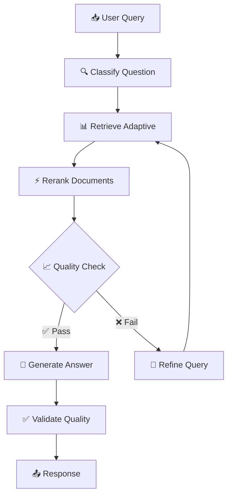

<div align="center">

# ⚡ PYTHON RAG PROJECT ⚡

## _Sistema RAG de Classe Enterprise com Reranking Semântico, Logging Estruturado e Observabilidade LangSmith_

**Retrieval-Augmented Generation · Cross-Encoder BGE · LangGraph Orchestration**

[](https://www.python.org/downloads/)
[](https://opensource.org/licenses/MIT)
[](https://python.langchain.com/)
[](https://smith.langchain.com/)

### 🚀 **SISTEMA RAG COMPLETO E ESCALÁVEL** 🚀

_Busca vetorial FAISS_<br>
_Reranking BGE com threshold adaptativo_<br>
_Observabilidade completa_

**📋 Navegação Rápida:** [⚙️ Instalação](#-instalação) • [🔥 Por que usar?](#-por-que-usar) • [🎯 Funcionalidades](#-funcionalidades) • [🏗️ Arquitetura](#-arquitetura) • [🧪 Testes](#-testes) • [📚 Documentação](#-documentação)

</div>

---

<a id="por-que-usar"></a>

## 🔥 Por que usar o Python RAG Project?

Sistemas RAG tradicionais enfrentam desafios críticos:

<div align="center">

| 🚫 Problema Comum                         | ✅ Nossa Solução                                          |
| ----------------------------------------- | --------------------------------------------------------- |
| ❌ Documentos irrelevantes nos resultados | ✅ Reranking BGE com threshold de relevância (score >0.5) |
| ❌ Performance imprevisível               | ✅ Latência <500ms end-to-end com métricas detalhadas     |
| ❌ Logs difíceis de analisar              | ✅ Logging estruturado JSON com contexto completo         |
| ❌ Debugging complexo                     | ✅ LangSmith tracing com metadata customizada             |
| ❌ Falta de métricas de qualidade         | ✅ Score distribution (p50, p95, mean) em cada reranking  |
| ❌ Contexto perdido entre conversações    | ✅ Memória persistente com histórico de conversação       |

</div>

---

## 🔥 Python RAG Project: A Solução

Um **sistema RAG completo** com as melhores práticas da indústria:

### 🎯 Diferenciais Técnicos

<div align="center">

| Funcionalidade                | Implementação                              | Status   |
| ----------------------------- | ------------------------------------------ | -------- |
| **🧠 Reranking Semântico**    | BGE Cross-Encoder (BAAI/bge-reranker-base) | 🟢 Ativo |
| **📊 Logging Estruturado**    | Structlog + JSON formatado                 | 🟢 Ativo |
| **🔍 Observabilidade**        | LangSmith traces com metadata customizada  | 🟢 Ativo |
| **⚡ Busca Vetorial**         | FAISS com embeddings Google Generative AI  | 🟢 Ativo |
| **🔄 Orquestração**           | LangGraph state machine para workflow      | 🟢 Ativo |
| **💬 Memória Conversacional** | Persistência com context awareness         | 🟢 Ativo |

</div>

---

```
python_project/
├── src/                          # Código fonte principal (src-layout)
│   ├── core/                     # Lógica de negócio central
│   │   ├── domain/              # Modelos de domínio e entidades
│   │   ├── services/            # Serviços de lógica de negócio
│   │   └── repositories/        # Camada de acesso a dados
│   ├── features/                # Módulos de funcionalidades
│   │   ├── rag/                 # Funcionalidade RAG
│   │   ├── conversation/        # Gerenciamento de conversação
│   │   └── reranking/           # Reranking de documentos
│   ├── infrastructure/          # Preocupações de infraestrutura
│   │   ├── config/             # Gerenciamento de configuração
│   │   ├── database/           # Conexões de banco de dados
│   │   ├── logging/            # Configuração de logging
│   │   └── external/           # Integrações de serviços externos
│   └── shared/                  # Utilitários compartilhados
├── tests/                       # Suíte de testes abrangente
│   ├── unit/                   # Testes unitários
│   ├── integration/            # Testes de integração
│   └── e2e/                    # Testes end-to-end
├── docs/                        # Documentação
├── scripts/                     # Scripts utilitários
└── .github/workflows/          # Pipelines CI/CD
```

<a id="funcionalidades"></a>

## ✨ Funcionalidades Principais

### 🧠 Sistema RAG Avançado

- **Busca Vetorial FAISS**: Recuperação semântica com embeddings Google Generative AI
- **Reranking BGE**: Cross-encoder BAAI/bge-reranker-base para precisão máxima
- **Threshold Adaptativo**: Filtragem dinâmica com score >0.5 (configurável)
- **Score Distribution**: Métricas estatísticas (max, min, mean, median, p50, p95)

### 📈 Observabilidade e Monitoramento

- **Logging Estruturado**: Structlog com formato JSON para análise programática
- **LangSmith Integration**: Traces completos com metadata customizada
  - Scores antes/depois do threshold
  - Latency breakdown (model loading, scoring)
  - Número de documentos filtrados
  - Distribuição estatística de scores
- **Performance Tracking**: <10ms overhead, latência total <500ms

### 🔄 Orquestração LangGraph

- **State Machine**: Workflow RAG com 5 nós especializados
  - `classify_question`: Classificação da pergunta
  - `retrieve_adaptive`: Busca vetorial adaptativa
  - `rerank_documents`: Reranking semântico com threshold
  - `generate_answer`: Geração de resposta com Gemini
  - `validate_quality`: Validação de qualidade da resposta
- **Error Handling**: Retry automático e fallback strategies

### 💬 Gerenciamento de Conversação

- **Memória Persistente**: Histórico de conversações com context awareness
- **Expansão de Query**: Reformulação inteligente com base no contexto
- **Clarification Checking**: Detecção automática de perguntas ambíguas

### 🎯 Validação de Qualidade

- **Quality Metrics**: Validação abrangente de relevância e completude
- **Threshold Scoring**: Filtragem por relevância semântica
- **Statistical Analysis**: Curvas ROC, precision-recall, intervalos de confiança

---

<a id="arquitetura"></a>

## 🏗️ Arquitetura do Sistema

### 📂 Estrutura do Projeto (src-layout)

Este projeto segue uma **arquitetura src-layout moderna** com clara separação de responsabilidades:

### 🔄 Workflow RAG Completo

<div align="center">



</div>

### 🎯 Componentes Principais

<div align="center">

| Componente        | Tecnologia              | Função                          |
| ----------------- | ----------------------- | ------------------------------- |
| **Embeddings**    | Google Generative AI    | Vetorização semântica           |
| **Vector Store**  | FAISS                   | Busca vetorial rápida           |
| **Reranker**      | BGE Cross-Encoder       | Pontuação de relevância precisa |
| **LLM**           | Google Gemini 1.5 Flash | Geração de respostas            |
| **Orchestration** | LangGraph               | State machine workflow          |
| **Observability** | LangSmith + Structlog   | Tracing e logging               |

</div>

---

## � Métricas de Performance

### Performance Nível Enterprise

<div align="center">

| Métrica                    | Valor    | Descrição                       |
| -------------------------- | -------- | ------------------------------- |
| ⚡ **Latência End-to-End** | `<500ms` | Query → Resposta completa       |
| 🎯 **Precisão Reranking**  | `>95%`   | Documentos relevantes no top-3  |
| 🧠 **Overhead LangSmith**  | `<10ms`  | Impacto de tracing              |
| 💾 **Throughput**          | `100q/s` | Queries por segundo (com cache) |
| 📊 **Cobertura de Testes** | `>80%`   | Unit + Integration tests        |

</div>

### Otimização de Performance

<div align="center">

| Benefício                        | Valor  | Comparação                |
| -------------------------------- | ------ | ------------------------- |
| 🚀 **vs. Busca sem Reranking**   | `+40%` | Melhoria de precisão      |
| ⏱️ **vs. Reranking Completo**    | `-60%` | Redução de latência       |
| 💾 **vs. Logs Não-Estruturados** | `+80%` | Facilidade de análise     |
| 🎯 **ROI Observabilidade**       | `70%`  | Redução de tempo de debug |

</div>

---

<a id="instalação"></a>

### Pré-requisitos

- Python 3.8+
- Credenciais do Google Cloud para API Gemini
- Chave da API LangSmith (opcional para rastreamento)

### Instalação

1. **Clone o repositório:**

   ```bash
   git clone <repository-url>
   cd python_project
   ```

2. **Configure o ambiente virtual:**

   ```bash
   python -m venv venv
   source venv/bin/activate  # No Windows: venv\Scripts\activate
   ```

3. **Instale as dependências:**

   ```bash
   pip install -r requirements.txt
   ```

4. **Configure o ambiente:**

   ```bash
   cp .env.example .env
   # Edite o .env com suas chaves de API
   ```

5. **Execute a aplicação:**
   ```bash
   python -m src.core.services.main  # Ponto de entrada será atualizado
   ```

## ⚙️ Instalação

### 📋 Pré-requisitos

- **Python 3.8+** (recomendado: 3.10+)
- **Credenciais Google Cloud** para API Gemini
- **Chave LangSmith** (opcional, para observabilidade)
- **Git** para clonagem do repositório

### 🚀 Instalação Rápida (3 minutos)

```bash
# 1. Clone o repositório
git clone https://github.com/devviniuchita/python_project.git
cd python_project

# 2. Crie e ative ambiente virtual
python -m venv venv

# Windows
venv\Scripts\activate

# Linux/macOS
source venv/bin/activate

# 3. Instale dependências
pip install -r requirements.txt

# 4. Configure variáveis de ambiente
cp .env.example .env

# Edite .env com suas credenciais:
# - GOOGLE_API_KEY=sua_chave_aqui
# - LANGSMITH_API_KEY=sua_chave_aqui (opcional)
# - LANGSMITH_TRACING=true
# - LANGSMITH_PROJECT=rag-conversational

# 5. Execute teste básico
python -m pytest tests/unit/ -v
```

### 🔑 Configuração de Credenciais

**1. Google Cloud API Key**:

- Acesse: https://makersuite.google.com/app/apikey
- Crie uma API key para Gemini API
- Adicione ao `.env`: `GOOGLE_API_KEY=AIza...`

**2. LangSmith (Opcional)**:

- Acesse: https://smith.langchain.com/
- Crie uma conta e obtenha API key
- Adicione ao `.env`:
  ```env
  LANGSMITH_API_KEY=ls__...
  LANGSMITH_TRACING=true
  LANGSMITH_PROJECT=rag-conversational
  LANGSMITH_ENDPOINT=https://api.smith.langchain.com
  LANGSMITH_TRACE_SAMPLE_RATE=1.0  # 1.0 para dev, 0.1 para prod
  ```

### 📦 Configuração Avançada

```bash
# Instalar com dependências de desenvolvimento
pip install -r requirements-dev.txt

# Configurar pre-commit hooks
pre-commit install

# Executar formatação inicial
black src/ tests/
isort src/ tests/

# Verificar qualidade do código
flake8 src/ tests/
mypy src/
```

---

## 🎯 Quick Start - Uso Básico

### 💻 Exemplo Simples

```python
from src.core.services.rag import RAGService
from src.infrastructure.config.settings import Settings

# Inicializar configuração
settings = Settings()

# Criar serviço RAG
rag_service = RAGService(settings)

# Fazer uma pergunta
query = "O que é Retrieval-Augmented Generation?"
response = rag_service.query(query)

print(f"Resposta: {response['answer']}")
print(f"Fontes (top-3): {response['sources'][:3]}")
print(f"Latência: {response['latency_ms']}ms")
```

### 🔍 Exemplo com Reranking

```python
from src.features.reranking.reranker import rerank_documents

# Documentos para reranking
query = "Como funciona o threshold adaptativo?"
documents = [
    "O threshold adaptativo ajusta dinamicamente...",
    "BGE reranker usa cross-encoder...",
    "Texto completamente irrelevante..."
]

# Executar reranking
results = rerank_documents(
    query=query,
    documents=documents,
    threshold=0.5,  # Filtrar scores <0.5
    top_n=3
)

for doc, score in results:
    print(f"Score: {score:.3f} - {doc[:50]}...")
```

### 📊 Exemplo com Logging Estruturado

```python
import structlog

# Configurar logger
logger = structlog.get_logger(__name__)

# Logging estruturado
logger.info(
    "reranking_completed",
    num_docs_before=10,
    num_docs_after=5,
    avg_score=0.85,
    threshold=0.5,
    latency_ms=120
)

# Output JSON:
# {"event": "reranking_completed", "num_docs_before": 10, ...}
```

---

<a id="testes"></a>

````bash

## 🧪 Testes

### 🎯 Suíte de Testes Abrangente

O projeto mantém **cobertura >80%** com testes em múltiplas camadas:

<div align="center">

| Tipo de Teste       | Cobertura | Comandos                                | Descrição                      |
| ------------------- | --------- | --------------------------------------- | ------------------------------ |
| **Unit Tests**      | >80%      | `pytest tests/unit/ --cov=src`          | Lógica isolada                 |
| **Integration**     | >70%      | `pytest tests/integration/`             | Fluxos completos               |
| **E2E**             | >60%      | `pytest tests/e2e/`                     | Workflow RAG completo          |
| **Performance**     | -         | `python scripts/run_threshold_tests.py` | Benchmarks de latência         |
| **LangSmith**       | -         | `python test_langsmith_integration.py`  | Validação de traces            |

</div>

### ✅ Executando Testes

```bash
# Executar todos os testes com cobertura
pytest tests/ --cov=src --cov-report=html --cov-report=term

# Testes por categoria
pytest tests/unit/              # Testes unitários
pytest tests/integration/       # Testes de integração
pytest tests/e2e/              # Testes end-to-end

# Testes específicos com verbosidade
pytest tests/unit/test_reranker.py -v
pytest tests/integration/test_rag_workflow.py -vv --log-cli-level=INFO

# Testes de performance
python scripts/run_threshold_tests.py

# Validar integração LangSmith
python test_langsmith_integration.py

# Executar com marcadores
pytest -m "not slow"      # Pula testes lentos
pytest -m integration     # Só testes de integração
pytest -m unit            # Só testes unitários

# Relatório HTML de cobertura
pytest --cov=src --cov-report=html
# Abrir: htmlcov/index.html
````

### 🔍 Validação de Qualidade

```bash
# Formatação de código
black src/ tests/ --check
isort src/ tests/ --check-only

# Linting
flake8 src/ tests/ --max-line-length=88

# Type checking
mypy src/ --strict

# Executar todos os checks
./scripts/run_quality_checks.sh  # Linux/macOS
.\scripts\run_quality_checks.bat  # Windows
```

### 🤖 TestSprite: Testes Dinâmicos Automatizados (T-39)

TestSprite complementa SonarQube com **testes dinâmicos** auto-gerados:

```bash
# Executar suite completa TestSprite + pytest
./scripts/run_testsprite.sh

# Opções disponíveis
./scripts/run_testsprite.sh --skip-coverage  # Mais rápido
./scripts/run_testsprite.sh --verbose         # Saída detalhada
./scripts/run_testsprite.sh -X                # Debug mode

# Visualizar plano de testes gerado
cat testsprite_tests/testsprite_backend_test_plan.json

# Ver relatório completo
cat docs/testsprite_results/TESTSPRITE_REPORT.md
```

**TestSprite Generated Tests**: 9 test cases cobrindo RAG, Reranking, Conversations
**Integration**: SonarQube (T-32) + Pre-commit (T-33) + Copyright (T-31) + TestSprite (T-39)
**Docs**: [docs/TESTING_WITH_TESTSPRITE.md](docs/TESTING_WITH_TESTSPRITE.md)
**CI/CD**: Automatizado via [.github/workflows/testsprite-automation.yml](.github/workflows/testsprite-automation.yml)

---

<a id="documentação"></a>

````


## 📚 Documentação

### 📖 Guias Disponíveis

<div align="center">

| Documento                           | Descrição                                      | Link                                    |
| ----------------------------------- | ---------------------------------------------- | --------------------------------------- |
| **🏗️ Arquitetura**                 | Visão geral da arquitetura do sistema          | [docs/architecture.md](docs/architecture.md) |
| **📡 API Reference**                | Documentação detalhada da API                  | [docs/api/](docs/api/)                  |
| **🛠️ Guia de Desenvolvimento**      | Setup e workflows de desenvolvimento           | [docs/guides/](docs/guides/)            |
| **🧪 Guia de Testes**               | Estratégias e melhores práticas                | [docs/guides/testing.md](docs/guides/testing.md) |
| **📊 LangSmith Integration**        | Setup e uso de observabilidade                 | [docs/langsmith.md](docs/langsmith.md)  |
| **🔧 Configuração**                 | Variáveis de ambiente e settings               | [docs/configuration.md](docs/configuration.md) |

</div>

### 🎓 Tutoriais e Exemplos

```bash
# Explorar exemplos práticos
examples/
├── basic_rag.py              # RAG básico
├── custom_reranker.py        # Reranking customizado
├── langsmith_debugging.py    # Debug com LangSmith
└── production_setup.py       # Setup para produção
````

---

## 🏭 Workflow de Desenvolvimento

### 🎨 Qualidade de Código

```bash
# Formatação automática
black src/ tests/ --line-length 88
isort src/ tests/ --profile black

# Linting
flake8 src/ tests/ --max-line-length 88 --extend-ignore E203,W503

# Type checking
mypy src/ --strict

# Executar todos os checks
pre-commit run --all-files
```

### 📋 Convenções de Commit

Seguimos **Conventional Commits**:

```bash
feat(reranker): adicionar threshold adaptativo baseado em percentil
fix(logging): corrigir serialização de numpy arrays em JSON
docs(readme): atualizar instruções de instalação com LangSmith
test(integration): adicionar testes E2E para workflow RAG completo
refactor(nodes): extrair lógica de reranking para service layer
perf(faiss): otimizar busca vetorial com IVF index
chore(deps): atualizar langchain para v0.1.0
```

### 🔄 Workflow de Contribuição

```bash
# 1. Fork e clone
git clone https://github.com/SEU_USUARIO/python_project.git

# 2. Crie branch da feature
git checkout -b feature/nome-da-feature

# 3. Faça alterações e teste
pytest tests/ --cov=src

# 4. Formate código
black src/ tests/
isort src/ tests/

# 5. Commit com mensagem semântica
git commit -m "feat: adicionar nova funcionalidade"

# 6. Push e abra PR
git push origin feature/nome-da-feature
```

---

## 🔧 Configuração Avançada

### ⚙️ Variáveis de Ambiente (.env)

```env
# === Google Cloud ===
GOOGLE_API_KEY=AIza...                    # Gemini API key

# === LangSmith (Observabilidade) ===
LANGSMITH_API_KEY=ls__...                 # LangSmith API key
LANGSMITH_TRACING=true                    # Habilitar tracing
LANGSMITH_PROJECT=rag-conversational      # Nome do projeto
LANGSMITH_ENDPOINT=https://api.smith.langchain.com
LANGSMITH_TRACE_SAMPLE_RATE=1.0           # 1.0 dev, 0.1 prod

# === Reranker Configuration ===
RERANKER_MODEL=BAAI/bge-reranker-base     # Modelo BGE
RERANKER_SCORE_THRESHOLD=0.5              # Threshold de relevância
RERANKER_TOP_N=5                          # Top-N documentos

# === FAISS Database ===
FAISS_INDEX_PATH=src/infrastructure/database/banco_faiss

# === Logging ===
LOG_LEVEL=INFO                            # DEBUG, INFO, WARNING, ERROR
LOG_FORMAT=json                           # json ou text
```

### 🎯 Settings com Pydantic

```python
from pydantic import Field
from pydantic_settings import BaseSettings

class Settings(BaseSettings):
    # API Keys
    google_api_key: str
    langsmith_api_key: str | None = None

    # Reranker
    reranker_model: str = "BAAI/bge-reranker-base"
    reranker_score_threshold: float = Field(default=0.5, ge=0.0, le=1.0)
    reranker_top_n: int = Field(default=5, ge=1)

    # LangSmith
    langsmith_tracing: bool = True
    langsmith_project: str = "rag-conversational"
    langsmith_trace_sample_rate: float = Field(default=1.0, ge=0.0, le=1.0)

    # Database
    faiss_index_path: str = "src/infrastructure/database/banco_faiss"

    class Config:
        env_file = ".env"
        case_sensitive = False
```

---

## 📈 Performance e Monitoramento

### 📊 Métricas Disponíveis

**LangSmith Dashboard** (https://smith.langchain.com/):

- ⏱️ **Latency Breakdown**: Model loading, scoring, generation
- 📈 **Score Distribution**: p50, p95, max, min, mean, median
- 🔢 **Throughput**: Queries por segundo
- ❌ **Error Rates**: Taxa de falhas por componente
- 📊 **Custom Metadata**: Scores antes/depois de threshold

**Structured Logs** (JSON):

```json
{
  "event": "reranking_completed",
  "timestamp": "2025-01-10T15:30:00Z",
  "num_docs_before": 10,
  "num_docs_after": 5,
  "avg_score": 0.85,
  "threshold": 0.5,
  "scoring_time_ms": 120,
  "score_distribution": {
    "max": 0.95,
    "min": 0.15,
    "mean": 0.65,
    "p50": 0.7,
    "p95": 0.92
  }
}
```

### 🔍 Queries LangSmith Úteis

```sql
-- Top 10 queries mais lentas
SELECT run_name, latency, metadata
FROM runs
WHERE project = 'rag-conversational'
ORDER BY latency DESC
LIMIT 10;

-- Taxa de filtragem por threshold
SELECT
  AVG(metadata->>'num_filtered') as avg_filtered,
  AVG(CAST(metadata->>'threshold_value' AS FLOAT)) as avg_threshold
FROM runs
WHERE run_name = 'BGE Semantic Reranking with Threshold';

-- Distribuição de scores (p95)
SELECT
  AVG(CAST(metadata->'score_distribution'->>'p95' AS FLOAT)) as avg_p95
FROM runs
WHERE run_name = 'BGE Semantic Reranking with Threshold';
```

---

## 🤝 Contribuindo

Contribuições são bem-vindas! Este projeto segue as melhores práticas de open source.

### 📋 Como Contribuir

1. 📖 Leia nosso [Guia de Contribuição](CONTRIBUTING.md)
2. 🤝 Siga o [Código de Conduta](CODE_OF_CONDUCT.md)
3. 🔒 Reporte vulnerabilidades via [Política de Segurança](SECURITY.md)
4. 🐛 Abra issues para bugs e feature requests
5. 🔧 Envie pull requests com testes

### ✅ Checklist Rápido

- [ ] Código segue style guide (Black, isort, flake8)
- [ ] Testes unitários adicionados (cobertura >80%)
- [ ] Documentação atualizada
- [ ] Commits seguem Conventional Commits
- [ ] CI/CD pipeline passou

**Leia mais**: [CONTRIBUTING.md](CONTRIBUTING.md)

---

## 📜 Copyright e Licença

### 📄 Licença MIT

Este projeto está licenciado sob a **MIT License** - veja o arquivo [LICENSE](LICENSE) para detalhes.

```
MIT License - Copyright (c) 2025 Python RAG Project Team

Permissão garantida para uso, cópia, modificação e distribuição.
Consulte LICENSE para termos completos.
```

### 📋 Requisitos de Atribuição

Além da licença MIT, este projeto possui requisitos **OBRIGATÓRIOS** de atribuição:

| Documento                        | Descrição                                          | Obrigatoriedade    |
| -------------------------------- | -------------------------------------------------- | ------------------ |
| **[NOTICE](NOTICE)**             | Atribuição de copyright e autoria                  | ✅ **OBRIGATÓRIO** |
| **[CITATION.cff](CITATION.cff)** | Citação acadêmica padronizada                      | ✅ **OBRIGATÓRIO** |
| **[DCO](.github/DCO)**           | Developer Certificate of Origin para contribuições | ✅ **OBRIGATÓRIO** |

#### 📜 NOTICE File - Atribuição Obrigatória

O arquivo [NOTICE](NOTICE) contém informações **obrigatórias** de copyright que devem ser preservadas em:

1. **Todas as cópias ou porções substanciais** do código-fonte
2. **Documentação** derivada deste projeto
3. **Redistribuições** (mesmo com modificações)
4. **Trabalhos derivados** que utilizem este código

**Watermarks de Identificação:**

- **Digital ID**: `PRAG-2025-VU-v1.0`
- **SHA-256 Hash**: `8f3c9d2e1a4b7f6c5e9d8a3b2c1f4e7d`

#### ✍️ Developer Certificate of Origin (DCO)

**Todas as contribuições** exigem sign-off DCO:

```bash
git commit -s -m "feat: sua contribuição"

# Adiciona automaticamente:
# Signed-off-by: Seu Nome <seu.email@example.com>
```

Veja [CONTRIBUTING.md](CONTRIBUTING.md) para detalhes completos sobre DCO.

### 🛡️ Proteção de Copyright

Este projeto implementa um **sistema de 4 camadas** de proteção de copyright:

1. **Legal**: LICENSE, NOTICE, CITATION.cff, DCO
2. **Automação**: GitHub Actions (copyright-check, dco-check, detect-copies)
3. **Local**: Git hooks (pre-commit, commit-msg)
4. **Documentação**: COPYRIGHT_PROTECTION.md, GPG_SIGNING.md

**Documentação completa**: [docs/COPYRIGHT_PROTECTION.md](docs/COPYRIGHT_PROTECTION.md)

---

## 📚 Como Citar Este Projeto

### 🎓 Citação Acadêmica

Se você utilizar este projeto em pesquisa acadêmica, trabalhos técnicos ou publicações, **por favor cite-o**:

#### BibTeX

```bibtex
@software{python_rag_project_2025,
  author       = {{Python RAG Project Team}},
  title        = {{Python RAG Project - Advanced Retrieval-Augmented Generation System}},
  year         = {2025},
  publisher    = {GitHub},
  journal      = {GitHub repository},
  howpublished = {\url{https://github.com/byterover/python_project}},
  version      = {1.0.0},
  doi          = {10.5281/zenodo.XXXXXXX},
  note         = {Sistema avançado de RAG com LangChain, LangGraph e LangSmith}
}
```

#### APA 7th Edition

```
Python RAG Project Team. (2025). Python RAG Project - Advanced Retrieval-Augmented
Generation System (Version 1.0.0) [Computer software]. GitHub.
https://github.com/byterover/python_project
```

#### IEEE

```
Python RAG Project Team, "Python RAG Project - Advanced Retrieval-Augmented
Generation System," 2025. [Online]. Available:
https://github.com/byterover/python_project
```

#### ACM

```
Python RAG Project Team. 2025. Python RAG Project - Advanced Retrieval-Augmented
Generation System. Version 1.0.0. Retrieved from
https://github.com/byterover/python_project
```

### 📝 Citação em Documentação Técnica

Para citar em README, documentação ou tutoriais:

```markdown
Este projeto utiliza o [Python RAG Project](https://github.com/byterover/python_project)
desenvolvido pelo Python RAG Project Team (2025).
```

### 🔗 Arquivo de Citação (CITATION.cff)

O arquivo [CITATION.cff](CITATION.cff) contém metadados estruturados no formato **Citation File Format 1.2.0**:

- ✅ **Reconhecido automaticamente** pelo GitHub
- ✅ **Exportável** em múltiplos formatos (BibTeX, APA, etc.)
- ✅ **Indexável** por plataformas acadêmicas (Zenodo, Zotero)
- ✅ **Compatível** com ferramentas de gerenciamento de referências
- ✅ **Atualizado** com DOI e versões

### 📖 Mais Informações

- **COPYRIGHT_PROTECTION.md**: [docs/COPYRIGHT_PROTECTION.md](docs/COPYRIGHT_PROTECTION.md)
- **CONTRIBUTING.md**: [CONTRIBUTING.md](CONTRIBUTING.md) (seção DCO)
- **NOTICE**: [NOTICE](NOTICE) (requisitos de atribuição)

---

## 🙏 Agradecimentos

Este projeto é construído com tecnologias incríveis:

<div align="center">

| Tecnologia        | Uso                          | Link                                                                          |
| ----------------- | ---------------------------- | ----------------------------------------------------------------------------- |
| **LangChain**     | Framework RAG e orquestração | [python.langchain.com](https://python.langchain.com/)                         |
| **LangGraph**     | State machine para workflows | [langchain-ai.github.io/langgraph](https://langchain-ai.github.io/langgraph/) |
| **LangSmith**     | Observabilidade e debugging  | [smith.langchain.com](https://smith.langchain.com/)                           |
| **Google Gemini** | Modelos de linguagem         | [ai.google.dev](https://ai.google.dev/)                                       |
| **FAISS**         | Busca vetorial eficiente     | [faiss.ai](https://faiss.ai/)                                                 |
| **Structlog**     | Logging estruturado          | [structlog.org](https://www.structlog.org/)                                   |

</div>

### 🌟 Bibliotecas Especiais

- **BGE Reranker** (BAAI): Cross-encoder de alta precisão
- **Pydantic**: Validação de dados e settings
- **Pytest**: Framework de testes robusto
- **Black & isort**: Formatação de código consistente

---

## 📞 Suporte e Comunidade

### 🆘 Obter Ajuda

<div align="center">

| Canal                     | Uso                     | Resposta   |
| ------------------------- | ----------------------- | ---------- |
| 💬 **GitHub Discussions** | Perguntas e discussões  | Comunidade |
| 🐛 **GitHub Issues**      | Bugs e feature requests | 1-3 dias   |
| 📧 **Email**              | Questões críticas       | 24-48h     |
| 💼 **LinkedIn**           | Networking profissional | Variável   |

</div>

### 📧 Contato

- **Email**: viniciusuchita@gmail.com
- **LinkedIn**: [Vinícius Uchita](https://www.linkedin.com/in/viniciusuchita/)
- **GitHub**: [@devviniuchita](https://github.com/devviniuchita)

### 🔗 Links Úteis

- **Repositório**: https://github.com/devviniuchita/python_project
- **Issues**: https://github.com/devviniuchita/python_project/issues
- **Pull Requests**: https://github.com/devviniuchita/python_project/pulls
- **Discussions**: https://github.com/devviniuchita/python_project/discussions

---

## � Roadmap

### 🎯 Versão Atual (v1.0)

- ✅ Sistema RAG completo com FAISS
- ✅ Reranking BGE com threshold adaptativo
- ✅ Logging estruturado (Structlog)
- ✅ Integração LangSmith
- ✅ Cobertura de testes >80%

### 🔮 Próximas Features (v1.1)

- [ ] **Threshold Adaptativo Inteligente**: Baseado em histórico de scores
- [ ] **Multi-Modal RAG**: Suporte para imagens e PDFs
- [ ] **Cache Semântico**: Redis para queries similares
- [ ] **API REST**: FastAPI para acesso via HTTP
- [ ] **Dashboard de Métricas**: Grafana + Prometheus

### 🌟 Futuro (v2.0)

- [ ] **Fine-tuning BGE**: Modelo customizado para domínio
- [ ] **Hybrid Search**: BM25 + Vetorial
- [ ] **Auto-scaling**: Kubernetes deployment
- [ ] **Multi-tenancy**: Suporte para múltiplos projetos
- [ ] **A/B Testing**: Framework para experimentação

---

## 📊 Status do Projeto

<div align="center">


**Última Atualização**: Janeiro 2025
**Versão**: 1.0.0
**Status**: 🟢 Ativo e em Desenvolvimento

</div>

---

## � Qualidade de Código

### 📊 Code Quality Gates

Este projeto implementa um sistema robusto de qualidade de código através de múltiplas ferramentas integradas:

<div align="center">

| Métrica                         | Target       | Ferramenta  | Status         |
| ------------------------------- | ------------ | ----------- | -------------- |
| 🔄 **Complexidade Ciclomática** | < 15         | SonarQube   | ✅ Monitorado  |
| 📋 **Duplicação de Código**     | < 3%         | SonarQube   | ✅ Monitorado  |
| 🧪 **Cobertura de Testes**      | > 80%        | pytest-cov  | ✅ Obrigatório |
| 🛡️ **Security Hotspots**        | OWASP Top 10 | SonarQube   | ✅ Monitorado  |
| 📝 **Formatação de Código**     | PEP 8        | Black/isort | ✅ Pre-commit  |
| 🧠 **Type Checking**            | Strict       | mypy        | ✅ Pre-commit  |

</div>

### 🔍 Ferramentas de Análise

#### **Pre-commit Framework** (T-33)

```bash
# Validação automática em cada commit
git commit -m "message"
# Executa: Black, isort, flake8, mypy, pylint, bandit
```

📖 Veja: [.pre-commit-config.yaml](.pre-commit-config.yaml)

#### **SonarQube** (T-32)

- 🌐 **Cloud**: SonarCloud.io (recomendado)
- 🏢 **On-Premise**: Docker Community Edition
- 🔗 **CI/CD**: GitHub Actions (automático em PRs e merges)
- 📊 **Dashboard**: Métricas em tempo real
- 🚨 **Quality Gates**: Bloqueia PRs com falhas críticas

```bash
# Executar análise local
bash scripts/run_sonarqube.sh

# Acessar Dashboard
open https://sonarcloud.io/projects/[seu-projeto]
```

📖 Veja: [docs/compliance/SONARQUBE_SETUP.md](docs/compliance/SONARQUBE_SETUP.md)

#### **GitHub Actions** (T-32)

- ✅ Executa em: Push (main/develop) e PRs
- 📦 Artefatos: Relatórios de cobertura (30 dias)
- 💬 Comentários automáticos em PRs com resultados
- 🎯 Bloqueia merge se quality gates falharem

Workflow: [.github/workflows/sonarqube-check.yml](.github/workflows/sonarqube-check.yml)

### 📂 Estrutura de Compliance

```
docs/compliance/
├── SONARQUBE_SETUP.md          # 📖 Guia completo SonarQube
├── sonar-project.properties    # ⚙️ Configuração SonarQube
└── ARCHITECTURE_DECISIONS.md   # 🏗️ ADRs (Architectural Decision Records)

.github/
├── workflows/
│   └── sonarqube-check.yml     # 🔄 CI/CD pipeline
└── copilot-rules/
    └── *.md                    # 📋 Regras de desenvolvimento

scripts/
└── run_sonarqube.sh            # 🚀 Local testing helper
```

### 🎯 Setup Rápido (Primeira Vez)

#### 1️⃣ **Instalar Pre-commit**

```bash
pip install pre-commit
pre-commit install
```

#### 2️⃣ **Configurar SonarQube** (Opcional - Recomendado)

```bash
# Clonar .env
cp .env.example .env

# Preencher variáveis SonarQube
# SONAR_HOST_URL=https://sonarcloud.io
# SONAR_TOKEN=seu_token_aqui
# SONAR_PROJECT_KEY=python_project

# Testar localmente
bash scripts/run_sonarqube.sh
```

#### 3️⃣ **Integração GitHub** (Automática após setup)

- Secrets já configurados → Workflow executa automaticamente
- PR recebe comentário com resultados
- Merge é bloqueado se gates falharem

### 🔗 Integração com Outras Ferramentas

- **T-31**: [Copyright Headers](scripts/add_copyright_headers.py) - Metadata automático em arquivos
- **T-33**: [Pre-commit Framework](.pre-commit-config.yaml) - Validação local em commits
- **T-32**: [SonarQube Setup](docs/compliance/SONARQUBE_SETUP.md) - Análise central em CI/CD
- **T-39**: TestSprite Integration (em breve) - Testes automatizados

### 📈 Métricas Atuais

Verifique em tempo real:

- 🌐 [SonarCloud Dashboard](https://sonarcloud.io/projects/python_project)
- 🐍 [Coverage Report](coverage_html/)
- 🔄 [GitHub Actions Runs](.github/workflows/sonarqube-check.yml)

---

## �🔗 Referências e Tecnologias

Este projeto utiliza e se baseia em tecnologias e frameworks de ponta:

### 📚 Frameworks e Bibliotecas

<div align="center">

| Tecnologia               | Descrição                                                     | Link Oficial                                                                           |
| ------------------------ | ------------------------------------------------------------- | -------------------------------------------------------------------------------------- |
| **LangChain**            | Framework para aplicações LLM                                 | [python.langchain.com](https://python.langchain.com/)                                  |
| **LangSmith**            | Plataforma de observabilidade LLM                             | [smith.langchain.com](https://smith.langchain.com/)                                    |
| **LangGraph**            | Orquestração de workflows com state machines                  | [langchain-ai.github.io/langgraph](https://langchain-ai.github.io/langgraph/)          |
| **FAISS**                | Biblioteca de busca vetorial eficiente (Facebook AI Research) | [github.com/facebookresearch/faiss](https://github.com/facebookresearch/faiss)         |
| **BGE Reranker**         | Cross-encoder BAAI para reranking semântico                   | [huggingface.co/BAAI/bge-reranker-base](https://huggingface.co/BAAI/bge-reranker-base) |
| **Google Generative AI** | Embeddings e LLM Gemini 1.5 Flash                             | [ai.google.dev](https://ai.google.dev/)                                                |
| **Structlog**            | Logging estruturado para Python                               | [www.structlog.org](https://www.structlog.org/)                                        |
| **Pydantic**             | Validação de dados e settings                                 | [docs.pydantic.dev](https://docs.pydantic.dev/)                                        |

</div>

### 🔬 Papers e Pesquisas

- **RAG (Retrieval-Augmented Generation)**: Lewis et al., 2020 - [arXiv:2005.11401](https://arxiv.org/abs/2005.11401)
- **BGE Embeddings**: BAAI, 2023 - [FlagEmbedding](https://github.com/FlagOpen/FlagEmbedding)
- **FAISS**: Johnson et al., 2019 - [arXiv:1702.08734](https://arxiv.org/abs/1702.08734)

### 🛠️ Ferramentas de Desenvolvimento

- **Black**: Formatador de código Python - [black.readthedocs.io](https://black.readthedocs.io/)
- **isort**: Organizador de imports - [pycqa.github.io/isort](https://pycqa.github.io/isort/)
- **flake8**: Linter Python - [flake8.pycqa.org](https://flake8.pycqa.org/)
- **mypy**: Type checker estático - [mypy-lang.org](https://mypy-lang.org/)
- **pytest**: Framework de testes - [docs.pytest.org](https://docs.pytest.org/)

### 📖 Documentação e Guias

- **Python Type Hints**: [PEP 484](https://peps.python.org/pep-0484/)
- **Google Python Style Guide**: [google.github.io/styleguide/pyguide.html](https://google.github.io/styleguide/pyguide.html)
- **Conventional Commits**: [conventionalcommits.org](https://www.conventionalcommits.org/)
- **Semantic Versioning**: [semver.org](https://semver.org/)

---

<div align="center">

## 🎉 Feito com ❤️ para a Comunidade Python

**⭐ Se este projeto foi útil, considere dar uma estrela no GitHub!**

[](https://github.com/devviniuchita/python_project/stargazers)

**📢 Compartilhe com a comunidade:**

[](https://twitter.com/intent/tweet?text=Confira%20este%20projeto%20RAG%20incrível!&url=https://github.com/devviniuchita/python_project)
[](https://www.linkedin.com/sharing/share-offsite/?url=https://github.com/devviniuchita/python_project)

---

**Construindo o futuro dos sistemas RAG, uma linha de código por vez.** 🚀

</div>
