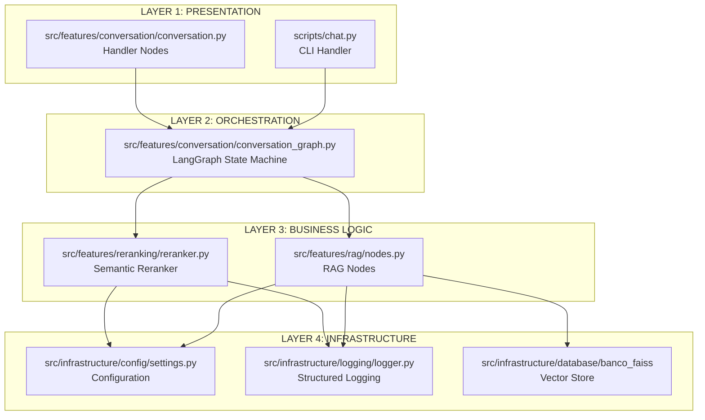

# 🗺️ Architecture Map - Python RAG Project

**Visual guide linking architectural rules ↔ implementation patterns ↔ actual files**

This document provides a **bidirectional navigation map** between:

- Architectural guidelines ([project-rules.md](../.github/copilot-rules/project-rules.md))
- Implementation patterns ([project-codification.md](../.github/copilot-rules/project-codification.md))
- Actual source files in the codebase

---

## 🏗️ 4-Layer Clean Architecture

**Rules Reference**: [project-rules.md - Clean Architecture](../.github/copilot-rules/project-rules.md#clean-architecture)
**Implementation Reference**: [project-codification.md - Arquitetura Enterprise](../.github/copilot-rules/project-codification.md#arquitetura-enterprise-hierárquica---padrões-validados)

---

## 📦 Critical Files Inventory

### LAYER 1: Presentation (CLI/HTTP Interface)

| File                                        | Lines | Purpose                              | Rules                                                                        | Implementation                                                                                           |
| ------------------------------------------- | ----- | ------------------------------------ | ---------------------------------------------------------------------------- | -------------------------------------------------------------------------------------------------------- |
| `scripts/chat.py`                           | ~150  | CLI interactive chat handler         | [Command Pattern](../.github/copilot-rules/project-rules.md#command-pattern) | [Layer 1 Pattern](../.github/copilot-rules/project-codification.md#layer-1-presentation)                 |
| `src/features/conversation/conversation.py` | ~240  | Handler nodes (@traceable)           | [Handler Pattern](../.github/copilot-rules/project-rules.md#handler-pattern) | [analyze_context implementation](../.github/copilot-rules/project-codification.md#handler-nodes-pattern) |
| `app.py`                                    | ~124  | Demo entry point (single/multi-turn) | [Demo Pattern](../.github/copilot-rules/project-rules.md#demo-pattern)       | See README.md#quickstart                                                                                 |

### LAYER 2: Orchestration (LangGraph State Machine)

| File                                              | Lines | Purpose                         | Rules                                                                            | Implementation                                                                                  |
| ------------------------------------------------- | ----- | ------------------------------- | -------------------------------------------------------------------------------- | ----------------------------------------------------------------------------------------------- |
| `src/features/conversation/conversation_graph.py` | ~210  | Create & run LangGraph workflow | [State Machine Pattern](../.github/copilot-rules/project-rules.md#state-machine) | [Layer 2 Orchestration](../.github/copilot-rules/project-codification.md#layer-2-orchestration) |
| `src/core/domain/state.py`                        | ~50   | RAGState TypedDict contract     | [Abstraction - TypedDict](../.github/copilot-rules/project-rules.md#abstraction) | [RAGState implementation](../.github/copilot-rules/project-codification.md#ragstate)            |

### LAYER 3: Business Logic (RAG Nodes & Strategies)

| File                                 | Lines | Purpose                               | Rules                                                                               | Implementation                                                                                    |
| ------------------------------------ | ----- | ------------------------------------- | ----------------------------------------------------------------------------------- | ------------------------------------------------------------------------------------------------- |
| `src/features/rag/nodes.py`          | ~300  | RAG workflow nodes (retrieve, rerank) | [Single Responsibility](../.github/copilot-rules/project-rules.md#solid-principles) | [Layer 3 Business Logic](../.github/copilot-rules/project-codification.md#layer-3-business-logic) |
| `src/features/reranking/reranker.py` | ~200  | BGE Cross-Encoder reranking           | [Encapsulation](../.github/copilot-rules/project-rules.md#encapsulation)            | [Reranker Pattern](../.github/copilot-rules/project-codification.md#reranker-pattern)             |

### LAYER 4: Infrastructure (Config, Logging, DB)

| File                                    | Lines | Purpose                                  | Rules                                                                           | Implementation                                                                                      |
| --------------------------------------- | ----- | ---------------------------------------- | ------------------------------------------------------------------------------- | --------------------------------------------------------------------------------------------------- |
| `src/infrastructure/config/settings.py` | ~80   | Pydantic settings with validation        | [Validation](../.github/copilot-rules/project-rules.md#validation-pattern)      | [Settings implementation](../.github/copilot-rules/project-codification.md#settings-implementation) |
| `src/core/domain/session.py`            | ~100  | SessionConfig with memory_ratio property | [Inheritance + Property](../.github/copilot-rules/project-rules.md#inheritance) | [SessionConfig pattern](../.github/copilot-rules/project-codification.md#sessionconfig)             |
| `src/infrastructure/logging/logger.py`  | ~60   | Structlog configuration                  | [Logging Pattern](../.github/copilot-rules/project-rules.md#logging-pattern)    | [Structured Logging](../.github/copilot-rules/project-codification.md#structured-logging)           |

---

## 🎯 SOLID Principles Mapping

### Single Responsibility (S)

| Concept               | Rule                                                                      | Implementation                                                                               | File                                         |
| --------------------- | ------------------------------------------------------------------------- | -------------------------------------------------------------------------------------------- | -------------------------------------------- |
| Each node has one job | [S Principle](../.github/copilot-rules/project-rules.md#solid-principles) | [retrieve_adaptive node](../.github/copilot-rules/project-codification.md#retrieve-adaptive) | `src/features/rag/nodes.py:50-80`            |
| Reranker only reranks | [S Principle](../.github/copilot-rules/project-rules.md#solid-principles) | [rerank_documents](../.github/copilot-rules/project-codification.md#rerank-documents)        | `src/features/reranking/reranker.py:100-150` |

### Open/Closed (O)

| Concept              | Rule                                                                      | Implementation                                                                         | File                                                     |
| -------------------- | ------------------------------------------------------------------------- | -------------------------------------------------------------------------------------- | -------------------------------------------------------- |
| Extend via new nodes | [O Principle](../.github/copilot-rules/project-rules.md#solid-principles) | [Add node to graph](../.github/copilot-rules/project-codification.md#add-node-pattern) | `src/features/conversation/conversation_graph.py:80-120` |

### Liskov Substitution (L)

| Concept                            | Rule                                                                      | Implementation                                                                                | File                               |
| ---------------------------------- | ------------------------------------------------------------------------- | --------------------------------------------------------------------------------------------- | ---------------------------------- |
| SessionConfig extends BaseSettings | [L Principle](../.github/copilot-rules/project-rules.md#solid-principles) | [SessionConfig(BaseSettings)](../.github/copilot-rules/project-codification.md#sessionconfig) | `src/core/domain/session.py:15-50` |

### Interface Segregation (I)

| Concept                             | Rule                                                                      | Implementation                                                                  | File                             |
| ----------------------------------- | ------------------------------------------------------------------------- | ------------------------------------------------------------------------------- | -------------------------------- |
| RAGState only exposes needed fields | [I Principle](../.github/copilot-rules/project-rules.md#solid-principles) | [TypedDict contract](../.github/copilot-rules/project-codification.md#ragstate) | `src/core/domain/state.py:10-38` |

### Dependency Inversion (D)

| Concept                       | Rule                                                                      | Implementation                                                                                 | File                                                      |
| ----------------------------- | ------------------------------------------------------------------------- | ---------------------------------------------------------------------------------------------- | --------------------------------------------------------- |
| Layer 2 depends on signatures | [D Principle](../.github/copilot-rules/project-rules.md#solid-principles) | [state -> dict pattern](../.github/copilot-rules/project-codification.md#dependency-inversion) | `src/features/conversation/conversation_graph.py:146-165` |

---

## 🔄 OOP Patterns Mapping

### Abstraction

**Concept**: TypedDict contracts isolate responsibilities
**Rule**: [Abstraction - TypedDict](../.github/copilot-rules/project-rules.md#abstraction)
**Implementation**: [RAGState TypedDict](../.github/copilot-rules/project-codification.md#ragstate)
**File**: `src/core/domain/state.py` (lines 10-38)

### Encapsulation

**Concept**: Private data + public interfaces
**Rule**: [Encapsulation Pattern](../.github/copilot-rules/project-rules.md#encapsulation)
**Implementation**: [Reranker encapsulation](../.github/copilot-rules/project-codification.md#reranker-pattern)
**File**: `src/features/reranking/reranker.py` (lines 50-100)

### Inheritance

**Concept**: SessionConfig extends BaseSettings
**Rule**: [Inheritance Pattern](../.github/copilot-rules/project-rules.md#inheritance)
**Implementation**: [SessionConfig(BaseSettings)](../.github/copilot-rules/project-codification.md#sessionconfig)
**File**: `src/core/domain/session.py` (lines 15-50)

### Polymorphism

**Concept**: Different node implementations, same signature
**Rule**: [Polymorphism Pattern](../.github/copilot-rules/project-rules.md#polymorphism)
**Implementation**: [Node polymorphism](../.github/copilot-rules/project-codification.md#node-polymorphism)
**Files**: `src/features/rag/nodes.py`, `src/features/conversation/conversation.py`

---

## 🧪 Testing Strategy Mapping

| Test Type         | Rule                                                                                          | Implementation      | File                                     |
| ----------------- | --------------------------------------------------------------------------------------------- | ------------------- | ---------------------------------------- |
| Unit Tests        | [Testing Requirements](../.github/copilot-rules/project-codification.md#testing-requirements) | AAA Pattern         | `tests/unit/test_reranker.py`            |
| Integration Tests | [Integration Testing](../.github/copilot-rules/project-codification.md#integration-testing)   | Workflow testing    | `tests/integration/test_rag_workflow.py` |
| E2E Tests         | [E2E Testing](../.github/copilot-rules/project-codification.md#e2e-testing)                   | Full system testing | `tests/e2e/test_conversational_flow.py`  |

---

## 📊 Quality Gates Mapping

| Quality Gate       | Rule                                                                                          | Implementation                     | Tool                       |
| ------------------ | --------------------------------------------------------------------------------------------- | ---------------------------------- | -------------------------- |
| Pre-commit Hooks   | [Pre-commit Framework](../.github/copilot-rules/tools-rules.md#pre-commit-framework)          | `.pre-commit-config.yaml`          | Black, isort, flake8, mypy |
| SonarQube Analysis | [SonarQube Setup](docs/compliance/SONARQUBE_SETUP.md)                                         | `sonar-project.properties`         | SonarQube Cloud            |
| Copyright Headers  | [Copyright Management](../.github/copilot-rules/project-codification.md#copyright-management) | `scripts/add_copyright_headers.py` | Custom script              |

---

## 🔗 Quick Navigation

### By Concern

- **Getting Started**: [docs/GETTING_STARTED.md](GETTING_STARTED.md)
- **Architecture Rules**: [.github/copilot-rules/project-rules.md](../.github/copilot-rules/project-rules.md)
- **Implementation Patterns**: [.github/copilot-rules/project-codification.md](../.github/copilot-rules/project-codification.md)
- **Testing Guide**: [docs/TESTING_WITH_TESTSPRITE.md](TESTING_WITH_TESTSPRITE.md)
- **Quality Compliance**: [docs/compliance/SONARQUBE_SETUP.md](compliance/SONARQUBE_SETUP.md)

### By Layer

- **Layer 1 (Presentation)**: `scripts/chat.py`, `src/features/conversation/conversation.py`
- **Layer 2 (Orchestration)**: `src/features/conversation/conversation_graph.py`
- **Layer 3 (Business Logic)**: `src/features/rag/nodes.py`, `src/features/reranking/reranker.py`
- **Layer 4 (Infrastructure)**: `src/infrastructure/config/`, `src/infrastructure/logging/`

### By Pattern

- **Command Pattern**: `scripts/chat.py` (CLI commands: /reset, /quit, /help)
- **Handler Pattern**: `src/features/conversation/conversation.py` (@traceable nodes)
- **State Machine**: `src/features/conversation/conversation_graph.py` (LangGraph)
- **Strategy Pattern**: `src/features/reranking/reranker.py` (BGE reranking strategy)

---

**📍 You are here: Architecture Map**

Navigate: [← Getting Started](GETTING_STARTED.md) | [Architecture Rules →](../.github/copilot-rules/project-rules.md) | [Implementation Patterns →](../.github/copilot-rules/project-codification.md)

